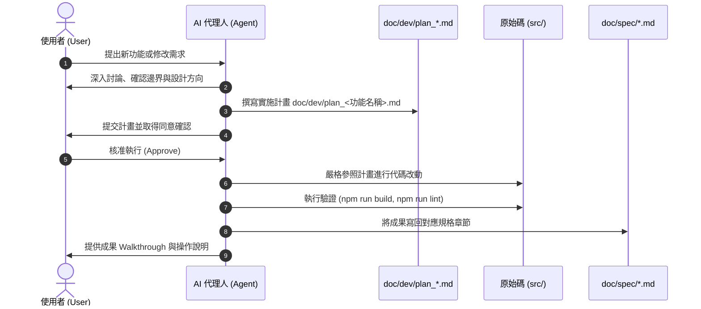

# AI 代理人開發工作規範 (AGENTS.md)

本文件定義所有參與本專案維護與開發之 AI 代理人 (Antigravity Agents / Cursor / Claude Code 等) 必須無條件嚴格遵守的工作流程與開發規範。

---

## 🚨 核心開發鐵律 (Non-Negotiable Core Rules)

### 1. 開發前先討論與立項 (Pre-Development Alignment)
- **嚴禁未經討論直接修改程式碼**。
- 接獲任何新功能需求、架構調整或介面重構時，**第一步必須先與使用者進行需求討論與技術對齊**。
- 討論確認可行性後，必須於 [`doc/dev/`](file:///c:/Users/Jieh/Documents/VScode%20Project/Coding-RFI-Project/doc/dev/) 目錄下建立實施計畫書。

### 2. 計畫書命名與格式標準 (Naming Convention & Plan Spec)
- **檔案命名規則**：`plan_<功能名稱>.md`
  - *正例*：`plan_rfi_export_pdf.md`、`plan_multi_project_switch.md`、`plan_custom_kanban_column.md`
  - *反例*：`new_feature.md`、`plan.md`、`dev_rfi.md`
- **計畫書必備內容**：
  1. 需求背景與使用者故事 (User Stories)
  2. 影響範圍評估（資料模型、元件、全域狀態）
  3. 逐步實施計畫 (Implementation Steps)
  4. 驗證與測試計畫 (Verification Plan)
  5. 預計寫回之規格章節 (Target Spec Chapter)

### 3. 開發過程依循計畫 (Plan-Driven Execution)
- 進入實作階段時，代理人必須嚴格遵循 `doc/dev/plan_<功能名稱>.md` 所列步驟進行修改。
- 嚴禁擅自擴充與既定目標無關的程式碼（落實 **Anti-Scope Creep** 原則）。

### 4. 開發完成後必須寫回規格書 (Post-Development Spec Sync)
- 功能開發完成且通過建置與驗證後，**不可直接結束任務**。
- 代理人**必須將最終定案之架構、資料欄位與操作行為寫回 [`doc/spec/`](file:///c:/Users/Jieh/Documents/VScode%20Project/Coding-RFI-Project/doc/spec/) 之對應章節**：
  - 第一章：[`01_overview.md`](file:///c:/Users/Jieh/Documents/VScode%20Project/Coding-RFI-Project/doc/spec/01_overview.md) (系統概述與範圍)
  - 第二章：[`02_architecture.md`](file:///c:/Users/Jieh/Documents/VScode%20Project/Coding-RFI-Project/doc/spec/02_architecture.md) (系統架構與技術棧)
  - 第三章：[`03_rbac_permissions.md`](file:///c:/Users/Jieh/Documents/VScode%20Project/Coding-RFI-Project/doc/spec/03_rbac_permissions.md) (角色權限控制 RBAC)
  - 第四章：[`04_kanban_and_gantt.md`](file:///c:/Users/Jieh/Documents/VScode%20Project/Coding-RFI-Project/doc/spec/04_kanban_and_gantt.md) (看板與甘特圖)
  - 第五章：[`05_rfi_tracking.md`](file:///c:/Users/Jieh/Documents/VScode%20Project/Coding-RFI-Project/doc/spec/05_rfi_tracking.md) (資訊需求單追蹤)
  - 第六章：[`06_attachments_clipboard.md`](file:///c:/Users/Jieh/Documents/VScode%20Project/Coding-RFI-Project/doc/spec/06_attachments_clipboard.md) (附件與剪貼簿截圖)
  - 第七章：[`07_notifications_audit.md`](file:///c:/Users/Jieh/Documents/VScode%20Project/Coding-RFI-Project/doc/spec/07_notifications_audit.md) (通知中心與審計日誌)
  - 若為全新獨立大模組，則建立新章節（如 `08_xxx.md`）並同步更新 [`doc/spec/README.md`](file:///c:/Users/Jieh/Documents/VScode%20Project/Coding-RFI-Project/doc/spec/README.md)。

---

## 🔄 標準開發生命週期圖 (Agent Workflow)

---

## 💻 技術與代碼規範 (Coding Standards)

1. **本地執行相容性**：
   - 所有改動必須確保相容於 Windows 環境下的 `start.bat` / `stop.bat` 與 `start.ps1` / `stop.ps1`。
   - 不得引入破壞 Windows 命令列相容性的依賴。
2. **TypeScript 嚴格型別**：
   - 資料模型必須統一收斂於 [`src/types.ts`](file:///c:/Users/Jieh/Documents/VScode%20Project/Coding-RFI-Project/src/types.ts)。
   - 禁止濫用 `any`，建置時必須通過 `tsc --noEmit`。
3. **UI/UX 設計語彙**：
   - 遵循 [`DESIGN.md`](file:///c:/Users/Jieh/Documents/VScode%20Project/Coding-RFI-Project/DESIGN.md) 規範，使用 Tailwind CSS v4 與 Lucide 圖示。
   - 所有面向使用者的文字介面一律採用**正體中文（繁體中文）**。
