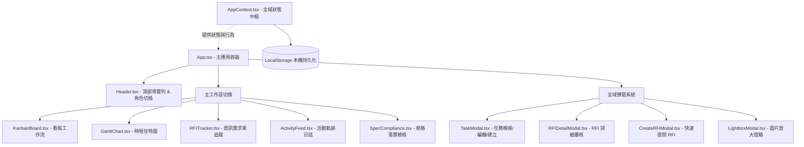
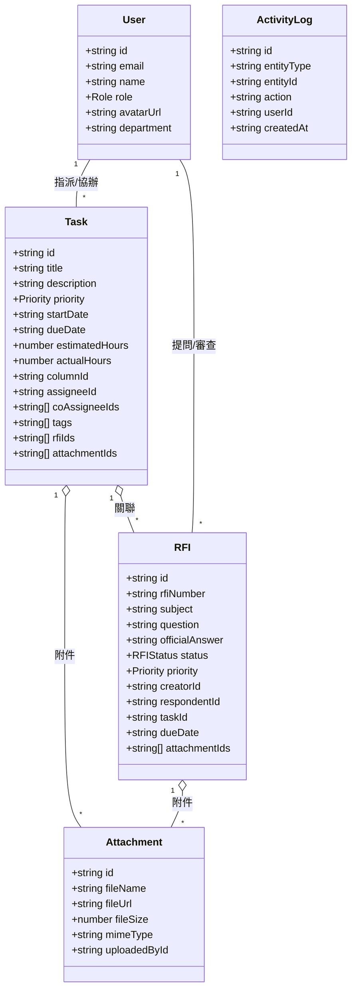

# 系統架構與設計指南 (DESIGN.md)

本文件詳細定義**專案管理與 RFI 追蹤系統 (Project Management & RFI Tracking System)** 的架構設計、視覺規範、元件體系與核心資料流。

---

## 1. 系統架構全景 (Architecture Overview)

系統採用現代化前端單頁應用架構 (SPA)，兼顧敏捷看板的高頻互動、甘特圖的大規模時間線渲染與企業級 RFI 追蹤流程。

---

## 2. 視覺設計系統 (Design System & Tokens)

系統遵循極致精緻、現代企業科技感 (Modern Enterprise Elegance) 的視覺準則：

### 2.1 字體系統 (Typography)
- **主要字體**：`Inter` (英數)、系統預設無襯線字體（繁體中文標準呈現）
- **程式碼/單號字體**：`JetBrains Mono`（用於 RFI 單號、時間標籤、ID 識別）

### 2.2 色彩配置 (Color Tokens)
- **基底背景**：`bg-slate-50`、卡片主色 `bg-white`、邊框 `border-slate-200`
- **品牌主色 (Primary)**：`indigo-600`（按鈕主調、選中高亮、關鍵操作）
- **狀態色階 (Status Palette)**：
  - `To Do / 草稿`：Slate 灰藍色系 (`bg-slate-100`, `text-slate-700`)
  - `In Progress / 處理中`：Blue 科技藍 (`bg-blue-100`, `text-blue-700`)
  - `Review / 審查中`：Amber 琥珀橙 (`bg-amber-100`, `text-amber-800`)
  - `Done / 已結案`：Emerald 翡翠綠 (`bg-emerald-100`, `text-emerald-800`)
  - `Rejected / 駁回`：Rose 玫瑰紅 (`bg-rose-100`, `text-rose-800`)
- **官方答覆專屬金 (Official Flag)**：`amber-500` / `yellow-400` 搭配金色徽章與光暈。

### 2.3 微互動與質感 (Micro-interactions & Glassmorphism)
- 彈窗與浮層採用柔和毛玻璃效果 (`backdrop-blur-md bg-slate-900/40`)。
- 卡片具備 Hover 上浮微位移效果 (`transition-all hover:shadow-md hover:-translate-y-0.5`)。
- 狀態變更與拖曳採用平滑過渡動畫。

---

## 3. 領域資料模型 (Domain Models)

全域資料結構定義於 [`src/types.ts`](file:///c:/Users/Jieh/Documents/VScode%20Project/Coding-RFI-Project/src/types.ts)：

---

## 4. 關鍵核心工作流 (Key Workflows)

### 4.1 看板卡片拖曳流程 (Kanban Drag & Drop)
1. 使用者在看板拖動卡片時，觸發 HTML5 `dragstart`，紀錄 `draggedTaskId`。
2. 懸停於目標欄位上方時，欄位邊框高亮 (`dragover`)。
3. 放開時 (`drop`) 驗證角色權限：
   - 若角色為 `CLIENT`，拒絕拖曳並提示權限不足。
   - 若為 `ADMIN` / `PM` / `MEMBER`，調用 `moveTask(taskId, targetColumnId)`。
4. 狀態更新並自動追加一筆審計日誌 (`ActivityLog`)。

### 4.2 RFI 官方正式答覆與一鍵轉化 (RFI to Task Workflow)
1. 提問者提交 RFI ➔ 狀態由 `DRAFT` 變更為 `SUBMITTED`。
2. 相關成員於留言區討論 ➔ PM/ADMIN 將某則結論標記為「官方答覆 (`isOfficialResponse`)」。
3. PM/ADMIN 點擊「一鍵轉化為卡片」：
   - 系統開啟 `TaskModal`，自動帶入 RFI 標題、說明與官方答覆內容。
   - 建立完成後，自動將新產生的卡片 ID 與 RFI 進行雙向綁定。

### 4.3 剪貼簿截圖即貼即用 (Clipboard Image Capture)
1. 元件內部監聽全域/區域 `onPaste` 事件。
2. 抓取 `e.clipboardData.items`，過濾出 MIME 類型為 `image/*` 之項目。
3. 透過 `FileReader.readAsDataURL` 轉化為資料串流，封裝為 `Attachment` 物件。
4. 自動關聯至當前正在編輯的卡片或 RFI 單號。
